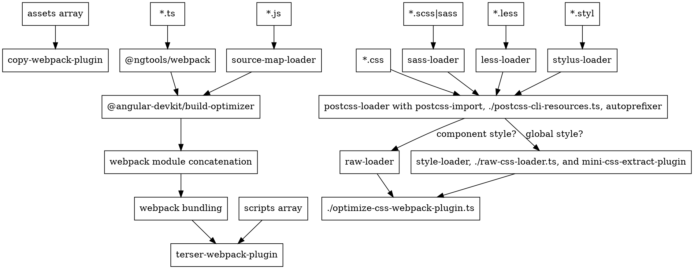

```
treee -L 1 -a -I node_modules --dirs-first

⭐ important 🌟 very important

⚡ has read ⏳ to do 🌙 no need to read
```

#### `tree`

```
angular-cli
├── .circleci
├── .github
├── .idea
├── .yarn
├── benchmark
├── bin
├── 🌟docs
├── etcsalou
├── integration
├── lib
├── 🌟packages
│   ├── angular🌙
│   │   ├── cli
│   │   └── pwa
│   ├── 🌟angular_devkit
│   │   ├── 🌟architect⏳
│   │   ├── architect_cli⏳
│   │   ├── benchmark
│   │   ├── ⭐build_angular⏳🌙
│   │   ├── build_ng_packagr⚡
│   │   ├── 🌟🌟build_optimizer⏳
│   │   ├── ⭐build_webpack⏳
│   │   ├── core
│   │   ├── ⭐schematics
│   │   └── ⭐⭐schematics_cli
│   ├── ngtools
│   │   └── ⭐webpack
│   ├── ⭐schematics
│   │   ├── angular🌙
│   │   ├── ⭐schematics
│   │   └── update🌙
│   ├── _
│   │   ├── benchmark
│   │   └── devkit
│   └── README.md
├── scripts
├── tests
├── third_party
├── tools
├── .bazelignore
├── .bazelrc
├── .bazelversion
├── .editorconfig
├── .gitattributes
├── .gitignore
├── .mailmap
├── .monorepo.json
├── .nvmrc
├── .prettierignore
├── .prettierrc
├── .yarnrc
├── BUILD.bazel
├── CONTRIBUTING.md
├── Dockerfile
├── LICENSE
├── package.json
├── README.md
├── renovate.json
├── tsconfig-test.json
├── tsconfig.json
├── tslint.json
├── WORKSPACE
└── yarn.lock
```

#### docs

https://github.com/angular/angular-cli/blob/master/docs/design/build-system.md

docs/design/build-system.md🌟

https://angular-builders.dev/home

#### main

Angular CLI => Angular DevKit

@angular/compiler-cli

- ngc
- ngcc

  Angular Compatibility Compiler (ngcc)
  This compiler will convert node_modules compiled with ngc, into node_modules which appear to have been compiled with ngtsc.
  This conversion will allow such "legacy" packages to be used by the Ivy rendering engine.



##### html

angularjs 基于浏览器执行变更检测

the creation of the DOM was delegated to the browser, which parsed your HTML and created the DOM tree (that’s its job, after all), and then AngularJS would run over the DOM elements, figure out the directives and text binding expressions and replace them with the actual data

浏览器不同 DOM 树不同，异常处理能力，过度依赖浏览器，大小写问题

angular 编译器将 html 转换成 typescript

The compiler actually replaces the browser and parses the HTML for you.


##### ngfactory

ngc

ngfactory

```bash
src
├── app
│ ├── route
│ │ ├── contacts
│ │ │ ├── departments
│ │ │ │ ├── departments.component.css.shim.ngstyle.js
│ │ │ │ ├── departments.component.css.shim.ngstyle.js.map
│ │ │ │ ├── departments.component.js
│ │ │ │ ├── departments.component.js.map
│ │ │ │ ├── departments.component.metadata.json
│ │ │ │ ├── departments.component.ngfactory.js
│ │ │ │ ├── departments.component.ngfactory.js.map
│ │ │ │ └── departments.component.ngsummary.json
│ │ │ ├── list
│ │ │ │ ├── list.component.css.shim.ngstyle.js
│ │ │ │ ├── list.component.css.shim.ngstyle.js.map
│ │ │ │ ├── list.component.js
│ │ │ │ ├── list.component.js.map
│ │ │ │ ├── list.component.metadata.json
│ │ │ │ ├── list.component.ngfactory.js
│ │ │ │ ├── list.component.ngfactory.js.map
│ │ │ │ └── list.component.ngsummary.json
│ │ │ ├── contacts-common.service.js
│ │ │ ├── contacts-common.service.js.map
│ │ │ ├── contacts-common.service.metadata.json
│ │ │ ├── contacts-common.service.ngfactory.js.map
│ │ │ ├── contacts-common.service.ngsummary.json
│ │ │ ├── contacts-routing.module.js
│ │ │ ├── contacts-routing.module.js.map
│ │ │ ├── contacts-routing.module.metadata.json
│ │ │ ├── contacts-routing.module.ngfactory.js
│ │ │ ├── contacts-routing.module.ngfactory.js.map
│ │ │ ├── contacts-routing.module.ngsummary.json
│ │ │ ├── contacts.module.js
│ │ │ ├── contacts.module.js.map
│ │ │ ├── contacts.module.metadata.json
│ │ │ ├── contacts.module.ngfactory.js
│ │ │ ├── contacts.module.ngfactory.js.map
│ │ │ ├── contacts.module.ngsummary.json
│ │ │ ├── contacts.service.js
│ │ │ ├── contacts.service.js.map
│ │ │ ├── contacts.service.metadata.json
│ │ │ ├── contacts.service.ngfactory.js.map
│ │ │ └── contacts.service.ngsummary.json
│ │ ├── exception
│ │ │ ├── 403.component.js
│ │ │ ├── 403.component.js.map
│ │ │ ├── 403.component.metadata.json
│ │ │ ├── 403.component.ngfactory.js
│ │ │ ├── 403.component.ngfactory.js.map
│ │ │ ├── 403.component.ngsummary.json
│ │ │ ├── 404.component.js
│ │ │ ├── 404.component.js.map
│ │ │ ├── 404.component.metadata.json
│ │ │ ├── 404.component.ngfactory.js
│ │ │ ├── 404.component.ngfactory.js.map
│ │ │ ├── 404.component.ngsummary.json
│ │ │ ├── 500.component.js
│ │ │ ├── 500.component.js.map
│ │ │ ├── 500.component.metadata.json
│ │ │ ├── 500.component.ngfactory.js
│ │ │ ├── 500.component.ngfactory.js.map
│ │ │ └── 500.component.ngsummary.json
│ │ ├── route-routing.module.js
│ │ ├── route-routing.module.js.map
│ │ ├── route-routing.module.metadata.json
│ │ ├── route-routing.module.ngfactory.js
│ │ ├── route-routing.module.ngfactory.js.map
│ │ ├── route-routing.module.ngsummary.json
│ │ ├── route.module.js
│ │ ├── route.module.js.map
│ │ ├── route.module.metadata.json
│ │ ├── route.module.ngfactory.js
│ │ ├── route.module.ngfactory.js.map
│ │ └── route.module.ngsummary.json
│ │ ├── index.js
│ │ ├── index.js.map
│ │ ├── index.metadata.json
│ │ ├── index.ngfactory.js
│ │ ├── index.ngfactory.js.map
│ │ ├── index.ngsummary.json
│ │ ├── shared.module.js
│ │ ├── shared.module.js.map
│ │ ├── shared.module.metadata.json
│ │ ├── shared.module.ngfactory.js
│ │ ├── shared.module.ngfactory.js.map
│ │ └── shared.module.ngsummary.json
│ ├── app.component.js
│ ├── app.component.js.map
│ ├── app.component.metadata.json
│ ├── app.component.ngfactory.js
│ ├── app.component.ngfactory.js.map
│ ├── app.component.ngsummary.json
│ ├── app.module.js
│ ├── app.module.js.map
│ ├── app.module.metadata.json
│ ├── app.module.ngfactory.js
│ ├── app.module.ngfactory.js.map
│ └── app.module.ngsummary.json
├── environments
│ ├── environment.js
│ ├── environment.js.map
│ ├── environment.metadata.json
│ ├── environment.ngsummary.json
│ ├── environment.prod.js
│ ├── environment.prod.js.map
│ ├── environment.prod.metadata.json
│ └── environment.prod.ngsummary.json
├── main.js
├── main.js.map
├── main.ngsummary.json
├── polyfills.js
├── polyfills.js.map
└── polyfills.ngsummary.json
```

`app.component.ngfactory.js`

```js
/**
 * @fileoverview This file was generated by the Angular template compiler. Do not edit.
 *
 * @suppress {suspiciousCode,uselessCode,missingProperties,missingOverride,checkTypes}
 * tslint:disable
 */

// import * as i0 from "@angular/core";
// import * as i1 from "@angular/router";
// import * as i2 from "./app.component";
// var styles_AppComponent = [];
// var RenderType_AppComponent = i0.ɵcrt({ encapsulation: 2, styles: styles_AppComponent, data: {} });
// export { RenderType_AppComponent as RenderType_AppComponent };
// export function View_AppComponent_0(_l) { return i0.ɵvid(0, [(_l()(), i0.ɵeld(0, 16777216, null, null, 1, "router-outlet", [], null, null, null, null, null)), i0.ɵdid(1, 212992, null, 0, i1.RouterOutlet, [i1.ChildrenOutletContexts, i0.ViewContainerRef, i0.ComponentFactoryResolver, [8, null], i0.ChangeDetectorRef], null, null)], function (_ck, _v) { _ck(_v, 1, 0); }, null); }
// export function View_AppComponent_Host_0(_l) { return i0.ɵvid(0, [(_l()(), i0.ɵeld(0, 0, null, null, 1, "app-root", [], null, null, null, View_AppComponent_0, RenderType_AppComponent)), i0.ɵdid(1, 114688, null, 0, i2.AppComponent, [], null, null)], function (_ck, _v) { _ck(_v, 1, 0); }, null); }
// var AppComponentNgFactory = i0.ɵccf("app-root", i2.AppComponent, View_AppComponent_Host_0, {}, {}, []);
// export { AppComponentNgFactory as AppComponentNgFactory };
//# sourceMappingURL=app.component.ngfactory.js.map
```

```js
/**
 * @fileoverview This file was generated by the Angular template compiler. Do not edit.
 *
 * @suppress {suspiciousCode,uselessCode,missingProperties,missingOverride,checkTypes}
 * tslint:disable
 */

// import * as i0 from "@angular/core";
// import * as i1 from "@angular/router";
// import * as i2 from "./app.component";
// var styles_AppComponent = [];
// var RenderType_AppComponent = i0.ɵcrt({ encapsulation: 2, styles: styles_AppComponent, data: {} });
// export { RenderType_AppComponent as RenderType_AppComponent };
// export function View_AppComponent_0(_l) { return i0.ɵvid(0, [(_l()(), i0.ɵeld(0, 16777216, null, null, 1, "router-outlet", [], null, null, null, null, null)), i0.ɵdid(1, 212992, null, 0, i1.RouterOutlet, [i1.ChildrenOutletContexts, i0.ViewContainerRef, i0.ComponentFactoryResolver, [8, null], i0.ChangeDetectorRef], null, null)], function (_ck, _v) { _ck(_v, 1, 0); }, null); }
// export function View_AppComponent_Host_0(_l) { return i0.ɵvid(0, [(_l()(), i0.ɵeld(0, 0, null, null, 1, "app-root", [], null, null, null, View_AppComponent_0, RenderType_AppComponent)), i0.ɵdid(1, 114688, null, 0, i2.AppComponent, [], null, null)], function (_ck, _v) { _ck(_v, 1, 0); }, null); }
// var AppComponentNgFactory = i0.ɵccf("app-root", i2.AppComponent, View_AppComponent_Host_0, {}, {}, []);
// export { AppComponentNgFactory as AppComponentNgFactory };
//# sourceMappingURL=app.component.ngfactory.js.map
```

```js
/**
 * @fileoverview This file was generated by the Angular template compiler. Do not edit.
 *
 * @suppress {suspiciousCode,uselessCode,missingProperties,missingOverride,checkTypes}
 * tslint:disable
 */

// import * as i0 from "@angular/core";
// import * as i1 from "@angular/router";
// import * as i2 from "./app.component";
// var styles_AppComponent = [];
// var RenderType_AppComponent = i0.ɵcrt({ encapsulation: 2, styles: styles_AppComponent, data: {} });
// export { RenderType_AppComponent as RenderType_AppComponent };
// export function View_AppComponent_0(_l) { return i0.ɵvid(0, [(_l()(), i0.ɵted(-1, null, [" hi,brother "])), (_l()(), i0.ɵeld(1, 16777216, null, null, 1, "router-outlet", [], null, null, null, null, null)), i0.ɵdid(2, 212992, null, 0, i1.RouterOutlet, [i1.ChildrenOutletContexts, i0.ViewContainerRef, i0.ComponentFactoryResolver, [8, null], i0.ChangeDetectorRef], null, null)], function (_ck, _v) { _ck(_v, 2, 0); }, null); }
// export function View_AppComponent_Host_0(_l) { return i0.ɵvid(0, [(_l()(), i0.ɵeld(0, 0, null, null, 1, "app-root", [], null, null, null, View_AppComponent_0, RenderType_AppComponent)), i0.ɵdid(1, 114688, null, 0, i2.AppComponent, [], null, null)], function (_ck, _v) { _ck(_v, 1, 0); }, null); }
// var AppComponentNgFactory = i0.ɵccf("app-root", i2.AppComponent, View_AppComponent_Host_0, {}, {}, []);
// export { AppComponentNgFactory as AppComponentNgFactory };
//# sourceMappingURL=app.component.ngfactory.js.map
```

#### packages🌟

##### webpack

packages/ngtools/webpack

##### ⭐schematics

##### ng_packagr

packages/angular_devkit/build_ng_packagr/src/build/index.ts

---

##### wtf with ngc ngcc

https://medium.com/angular-in-depth/a-deep-deep-deep-deep-deep-dive-into-the-angular-compiler-5379171ffb7a
